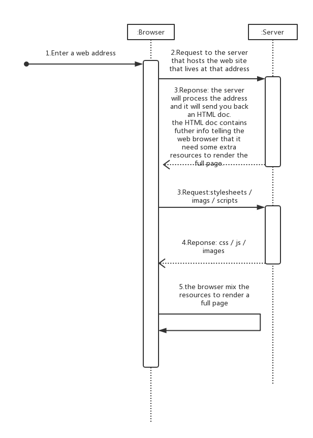
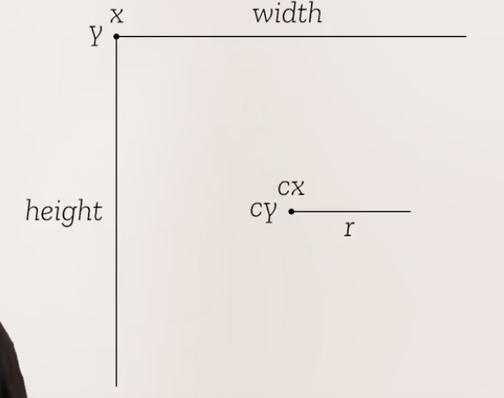
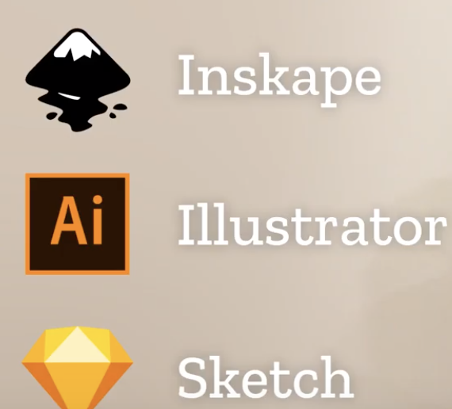

# Web Demystified (简明的解释) 教程的笔记  
> Youtube Mozilla Hacks Channel    
> By Jeremie Patonnier  

## What is "The Web" and how does it work? | Web Demystified, Episode 0 | The Web
> Jeremie Patonnier offers an overview of **what the web is and how it works**. If you're just getting started on the web, this is an important overview for you!  

1.The web is a collection of documents that will be requested by a browser from a server.  
> **Documents are available on servers.**  

2.Each document is accessible through a web address.  
> **Documents are accessible through a web address.**  

3.The browser will mix all the necessary documents to turn any HTML document into a nice web page.  
> **Browsers mix documents to render web pages.**  

  

```c
/* 需要注意的是：1.SVG 会随着浏览器的不同而渲染出不同的效果；2.文件名不能留空格。 */
```

## What's HTML and how does it work? | Web Demystified, Episode 1  

> Basically HTML is a **descriptive language** that allows us to tell a web browser how to handle text content.  

* By Tim Berners Lee  
* HTML (HyperText Markup Language)
  * a HTML document can create a link to other HTML document  
  * a system to annotate some plain text with tags

1.**HTML is markup langugage**.  
> HTML is a markup language that allows to structure a text in order to make it understandable by web browsers.   

2.**HTML is made of elements formed by tags**.  
> That HTML markup is made of elements formed by tags put around text.  

3.**HTML is maintained by the W3C**.  
All vaild HTML elements and their nesting rules are defined in a specification maintained by the W3C.  

```html
<!DOCTYPE html>
<head>
  <title>...</title>    
</head>
<body>
  <p>My cat is <strong>VERY</strong> grumpy!</p>
</body>
</html>
```

## What is CSS and how does it style web pages? | Web Demystified, Episode 2  
> Like HTML, CSS is a descriptive language, but instead of defining a semantic for some text it defines the look and feel of each HTML element.  

> In other words, CSS is like makeup for HTML.  

* CSS is an acronym standing for `Cascading Style Sheets`.  
* At the end of the 90's with the idea to create a clear distinction between text semantics and presentation.
 * 1996, CSS1
 * 2011, CSS2  
 * CSS3 -> More fine grain, Since than  

 There are 3 ways to apply CSS to an HTML document. But the below way is the only way recommanded.  

```html
<span style=""></span>
```

 ```html
 <link rel="stylesheet" href="styles.css">
 ```  

 CSS rule:  
 ```css
 selectors {
    property name: property value;
 }
 ```

1.`CSS` is a declarative language that allows you to define the look and feel of `HTML` elements.  
> `CSS` allows to define the look and feel of `HTML`.  

2.Styles rules target `HTML` elements with selectors and they applied visual effects defined by style declarations.  
> Style rules define the visual effects to apply.  

3.The cascade allows to override and combine those rules.  
> The cascade defines how to mix style rules.  


## What is JavaScript and how does it work? | Web Demystified, Episode 3  
> `JavaScript` is the programing language at the heart of the modern web.  

* `JavaScript` was crated in 1995, but very quickly in 1997, it has been standardized at the standards organization ECMA International under the name `ECMAScript`.  
* `ECMAScript` defines the basic syntax of the language, and its core mechanisms. But in itself, it doesn't do very much.  

* Two flavors of `JavaScript`:  
    * `JavaScript` in the browser:  
        * modify your `HTML` doc (`DOM`)  
        * making network requests (Fetch `XMLHttpRequest`)  
        * managing data (Web Storage IndexedDB)  
        * doing audio and graphics redering (Web Audio / WebGL / Canvas 2D)  
        *  

    * `JavaScript` on the server (node.js)  
        * manage the computer directly  
        * accesss files and folder  
        * handle network resources  
        * spawn processes (多线程)
        * etc.

### Let's focus on JavaScript inside the browser:  

Like `CSS`, `JavaScript` is embedded in HTML using a specific HTML element:  

```html
<script>
    /*Your code here.*/
    alert("Hello, I',m JavaScript!");
</script>
```

```html
<script src="my-script.js"></script>
```

1.`JavaScript` is a programing language.  

2.It's a combination of the `ECMAScript` standard with other standard functionalities.  
> It's made of `ECMAScript` plus some standard APIs.  

3.It's highly asnchronous and it can react to events.  
> It has access to asynchronous features.  


## What are Scalable Vector Graphics (SVG) & how are they special? | Web Demystified, Episode 4  | SVG
> `SVG` is a acronym standing for `Scalable Vector Graphics`, and it's the only vector image format for the web.  

### 1.Bitmap VS. Vector  

Images exist in two flavors:  
* Bitmaps  

* Vectors  


Bitmap iamges "simply" define what color each pixel of the iamge should be painted.  

The most common bitmap image format for the web are `JPEG`, `PNG` and `GIF`.  

  

Vector images act differently.  

They provide a set of instructions about how the image should be rendered, and it's up to rendering software to compute how each pixel should be colored.    

  

  

### 2.Benefits and limitations  

There are a lot of benefits and limitations to each format, but to make it short:  
* **Bitmap images** are well suited for highly detailed iamges, such as **photographs**;  
* **Vector iamges** are well suited for less detailed images that need to be scaled at different sizes, like **icons** or **data representations**.  

### 3.SVG  

First, it's a text format written with `tags`, like `HTML`.  

Second, it can be styled with `CSS`, like `HTML`.  

Third, it can be scrpted with `JavaScript`, like `HTML`.

```html
<svg xmlns="https://www.w3.org/2000/svg" viewBox="0 0 10 10">
    <style>
    rect {
        fill:yellow;
        stroke: red;
        cursor: pointer;
    }
    </style>
    <script>
    // Once the document is loaded
    window.addEventListener("load", () => {
        var rect = document.querySelector("rect");

        // When you click on the rectangle
        rect.addEventListener("click", () => {

                // Pick a random number between 0 and 16777215
                var fill = Math.ceil(Math.random() * 0xffffff);

                // Stringify to make if a valid CSS color
                fill = fill.toString(16).padStart(6, "0");

                // Apply the color to the rectangle
                rect.style.fill = `#${fill}`;
        });
    });
    </script>
    <rect x="2" y="2" width="6" height="6" />
</svg>
```  

### 4.A good pieve of vector drawing software  
> I'm definitely a drawing software person.  

Inskape, Illustrator and Sketch are very likely the most used software to output SVG out of the box.  

  


### 5.There are many JavaScript libraries that can be very helpful  


### 6.Recap  

1.`SVG` is a vector image format for the web, perfect to create images that stay sharp at any scale.  
> `SVG` is a vector iamge format  

2.It can be authored, styled and scripted like `HTML` would be.  
> It can be styled and scripted like `HTML`.   

3.Creating such images by hand is not impossible but it's easier to use a drawing software to do so.    
> It's easier to use a drawing tool to create an SVG image.   

## How do web browsers work? | Web Demystified, Episode 5  | How browsers work?
> web browsers are mixing things together in order to display web documents.  

### 1.What are exactly browsers able to do these days?  

**First of all**, because the web is all about requesting documentws stored on the Internet, they are able to **handle network connections**.  

* Historically, that was done using the `HTTP` protocol to perform simple CRUD operations on documents.  
* But nowadays they can also create bidirectional communication channels with a server.  
* Or they can even create a peer-to-peer connections with another browser.  

**Second**, they have to be able to understand, render and/or execute different languages.  

They also have to be able to render fonts, images, audio and videos.  

**Third**, everthing you see in a browser must be interactive. You can select text, scroll pages, click on links, input text, drag and drop content, etc.  

**Fourth**, they can store data, either by caching content or providing various storage mechanisms.  

**Fifth**, all of this must work regardless of the complexity of each page and regardless of the number of pages open at the same time!  

**Last but not least**, because the Internet remains a wild place and because websites can aggregate contents from very different sources, things have to be reasonably **secured**.  
* be able to manage data encryption.  
* and to sandbox every set of content in order to prevent malicious code to accesss other content.  


### 2.There are two ways to handle interactivity  

On the one hand, there are all the native interactions that the browser is providing, usually through `HTML` and `CSS`.  

On the other hand, there is what JavaScript lets people do.  

### 3.Recap  

1.Browsers handle a lot of things:  
* networks  
* content display  
* data storage  
* content security  
all in a very interactive way.  
> Browsers handle network, content display, data storage, and contentsecurity.  

2.They handle technical requirements that can be compared to those of super high-end games.  
> Their technical requirements are the same sa those of AAA games.  

3.They give content creators the ability to create any form of interactivity.  
> They let web creators building any type of content.
