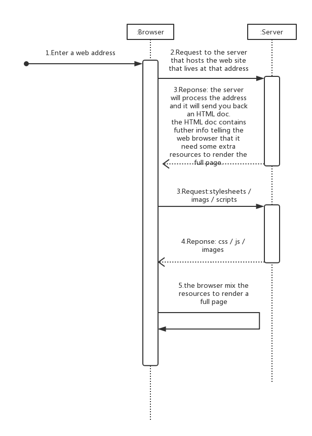

# Web Demystified (简明的解释) 教程的笔记  
> Youtube Mozilla Hacks Channel  

## What is "The Web" and how does it work? | Web Demystified, Episode 0 | The Web
> Jeremie Patonnier offers an overview of **what the web is and how it works**. If you're just getting started on the web, this is an important overview for you!  

Hello!. Welcome to Web Demystified.  

I’m Jeremie and in this series of videos we are gonna try to make the web easy.  

So today, in this special episode (章节), I’m gonna give you a quick overview of what the web is and how it works.  

Yeah! Maybe there will be stuff you already know, but you could be surprised.  

And if you’re not, show this video to someone who will be!  

Anyway, we have to start somewhere… so let’s go!  

Everything starts with your favorite browser where you type a web address.  

Nope! I use Google.  

Yes… and Google, like any other search engine that you could use, is nothing but a web site for which you have to type its web address.  

Ok don’t worry, this is just an overview. We will talk about search engines and searching the web in another video.  

So as you type a web address…  

The technical name for a web address is a `URL`(Uniform Resource Locator)…  

and it’s maybe better to save that for another video.  

So as you type a web address and hit the “Enter” key  OR click a link from a search page, your browser will send a request to the server that hosts the web site that lives at that address.  

There, the server will process the address and it will send you back an HTML document.  

And, yes, we will get into the details of how server and request work… in another video.  

Next, the browser retrieves (取回) the HTML document and it reads it.  

Usually, the HTML document contains further information telling the web browser that it needs some extra resources to render the full page.  

For example: stylesheets (to know how to display the document), images, or even scripts (to attach special effects).  

Yes, you got it right… other videos to cover all of that.  

Yes, you got it right… other videos to cover all of that. Your browser will request all those extra ressources, and once it gets all the resources, it will mix them all together to, at last, display the web page you were expecting.   

Okay, let's recap!  

The web is a collection of documents that will be requested by a browser from a server.  
> **1.Documents are available on servers.**  

Each document is accessible through a web address.  
> **2.Documents are accessible through a web address.**  

The browser will mix all the necessary documents to turn any HTML document into a nice web page.  
> **3.Browsers mix documents to render web pages.**  

Yes, the web is nothing else than that.  

Of course that simplicity (简化) hides many subtle (细微的) things. Things that we will explore…

Thank you for watching our very first video.  

As you might guess, many others are in the pipe and they should arrive very soon.  

If you liked it, share it with your friends.  

If you didn’t… I don't know, share it with your… arch enemy for example?  

If you want to continue the discussion feel free to comment down below or join me and my colleagues on Twitter.  

And until next time… Long live the open web! Bye!  

## What's HTML and how does it work? | Web Demystified, Episode 1  

## What is CSS and how does it style web pages? | Web Demystified, Episode 2  

## What is JavaScript and how does it work? | Web Demystified, Episode 3  

## What are Scalable Vector Graphics (SVG) & how are they special? | Web Demystified, Episode 4  

## How do web browsers work? | Web Demystified, Episode 5  

